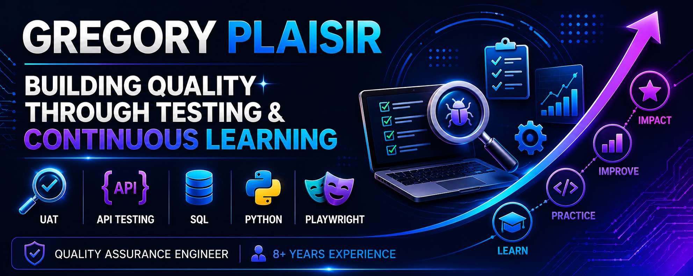

  

Hi, I'm Gregory Plaisir 👋🏿

### Quality Assurance Engineer | UAT | API Testing | SQL | Python | Playwright

---

## 🚀 About Me

🔹 8+ Years of Quality Assurance Experience

🔹 Financial Services | Mortgage Technology | Government & Defense | SaaS

🔹 Specialized in UAT, Functional Testing, Regression Testing, API Testing, and SQL Validation

🔹 Currently growing into Quality Engineering through Python, Playwright, API Testing, and SQL Data Validation

---

## 🎯 Current Focus

* 📚 SQL Data Validation
* 📚 API Testing with Postman
* 📚 Python
* 📚 Playwright Automation
* 📚 Quality Engineering Best Practices
* 📚 GitHub Portfolio Development

---

## 🛠️ QA & Testing

---

## 💻 Technical Skills

---

## 🌱 Currently Learning

---

## 📂 Featured Projects

🚧 SQL QA Data Validation Project

🚧 Postman API Testing Project

🚧 QA Test Planning & UAT Portfolio

🚧 Playwright Python Automation Project

🚧 Business Analysis & Requirements Validation Portfolio

🚧 QA Data Analytics Project

---

## 🎯 Career Interests

* Quality Assurance Engineer
* Senior QA Analyst
* UAT Analyst
* Quality Engineer
* Application Support Analyst
* Technical Support Engineer
* Future SDET Opportunities

---
## 👀 Profile Views

---
## 🤝 Connect With Me

💼 LinkedIn: linkedin.com/in/gregoryplaisir

---

> *"Quality is never an accident; it is always the result of intelligent effort."*
