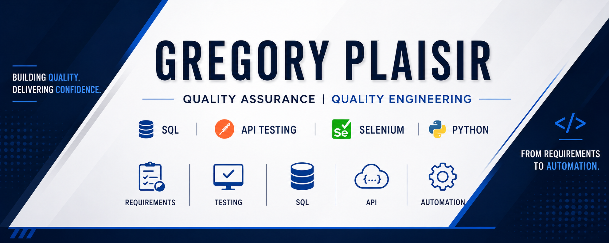

  

# Hi, I'm Gregory Plaisir 👋🏿

### Quality Assurance Professional | SQL | API Testing | Selenium | Python

---

## 🚀 About Me

🔹 8+ years of Quality Assurance experience across Financial Services, Mortgage Technology, Government & Defense, and SaaS platforms.

🔹 Experienced in UAT, Functional Testing, Regression Testing, End-to-End Testing, API Testing, SQL Validation, Defect Management, and Agile methodologies.

🔹 Currently transitioning from traditional QA into Quality Engineering through hands-on portfolio projects focused on SQL validation, API testing, Selenium automation, and end-to-end software quality practices.

🔹 Passionate about understanding how applications work across the full stack—from requirements and business rules to APIs, databases, automation, and production-quality testing.

---

## 🎯 Current Focus

* SQL Data Validation
* API Testing with Postman
* Python for QA
* Selenium Automation
* Quality Engineering Best Practices
* Building an End-to-End QA Engineering Portfolio

---

## 🛠️ QA & Testing Skills

---

## 💻 Technical Skills

---

## 🌱 Currently Learning

---

## ⭐ Flagship Project

### Customer Order Management System – QA Portfolio

An end-to-end QA Engineering portfolio project demonstrating:

- Business Requirements Analysis
- User Stories & Acceptance Criteria
- Test Planning
- Requirements Traceability
- SQL Data Validation
- API Testing
- Selenium Automation
- Defect Management
- Test Reporting
- SDLC & STLC Best Practices

Application Modules:

- Login
- Customers
- Products
- Orders
- Reports

Technology Stack:

- Python Flask
- MySQL
- SQL
- Postman
- Selenium
- GitHub

---

## 📂 Additional Projects

### SQL QA Validation Lab

QA-focused SQL validation scenarios covering:

- Aggregations
- GROUP BY
- HAVING
- Subqueries
- Joins
- Reporting Validation

### Postman API Testing Portfolio

REST API testing demonstrating:

- GET
- POST
- PUT
- DELETE
- Response Validation
- Environment Management

### Selenium Automation Portfolio

UI automation demonstrating:

- Smoke Testing
- Regression Testing
- End-to-End Testing
- Page Object Model Framework

---

## 🎯 Career Path

QA Engineer

↓

Quality Engineer

↓

Senior Quality Engineer

↓

SDET / Automation Engineer

---

## 👀 Profile Views

---

## 🤝 Connect With Me

💼 LinkedIn: linkedin.com/in/gregoryplaisir

---

> *"Quality is never an accident; it is always the result of intelligent effort."*
